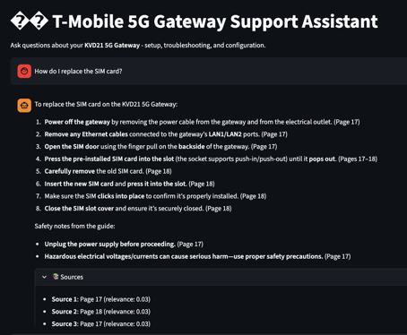

# Task 1 Solution: Knowledge Retrieval RAG Pipeline

> **Author:** [Your Name]  
> **Date:** January 2026  
> **Task:** Build a RAG-powered support assistant for T-Mobile 5G Gateway troubleshooting

---

## 1. Architecture Summary

### High-Level Architecture

```
┌──────────────────────────────────────────────────────────────────────────────┐
│                           RAG SUPPORT ASSISTANT                              │
├──────────────────────────────────────────────────────────────────────────────┤
│                                                                              │
│  ┌─────────────┐     ┌─────────────────┐     ┌─────────────────────────┐     │
│  │  Streamlit  │     │   RAG Pipeline  │     │     Azure Services      │     │
│  │     UI      │────▶│  Orchestrator   │────▶│                         │     │
│  │   (app.py)  │     │                 │     │  ┌─────────────────┐    │     │
│  └─────────────┘     │  1. Retrieve    │     │  │ Azure AI Search │    │     │
│                      │  2. Augment     │     │  │  (Vector Store) │    │     │
│                      │  3. Generate    │     │  └─────────────────┘    │     │
│                      └─────────────────┘     │                         │     │
│                                              │  ┌─────────────────┐    │     │
│  ┌─────────────┐     ┌─────────────────┐     │  │  Azure OpenAI   │    │     │
│  │    PDF      │     │   Embeddings    │────▶│  │  (GPT-5.2 +     │    │     │
│  │  Document   │────▶│   + Indexing    │     │  │   Embeddings)   │    │     │
│  │             │     │                 │     │  └─────────────────┘    │     │
│  └─────────────┘     └─────────────────┘     └─────────────────────────┘     │
│                                                                              │
└──────────────────────────────────────────────────────────────────────────────┘
```

### Component Architecture

```
task1-Knowledge-Retrieval/
├── app.py                      # Streamlit chat interface
├── scripts/
│   └── index_document.py       # One-time document indexing script
└── src/
    ├── config.py               # Configuration management (env vars)
    ├── pdf_processor.py        # PDF extraction & chunking
    ├── embeddings.py           # Azure OpenAI embeddings client
    ├── search_client.py        # Azure AI Search operations
    └── rag_pipeline.py         # RAG orchestration (retrieve → augment → generate)
```

### Key Services & Technologies

| Component | Technology | Purpose |
|-----------|------------|---------|
| **Frontend** | Streamlit | Interactive chat interface with example queries |
| **Vector Store** | Azure AI Search | Hybrid search (vector + full-text) with HNSW index |
| **Embeddings** | Azure OpenAI (`text-embedding-ada-002`) | 1536-dimension vectors for semantic similarity |
| **LLM** | Azure OpenAI (`GPT-5.2`) | Response generation with grounding |
| **PDF Processing** | pypdf + pdfplumber | Text extraction with fallback strategy |
| **Text Splitting** | LangChain `RecursiveCharacterTextSplitter` | Semantic chunking with overlap |
| **Authentication** | Azure Identity (DefaultAzureCredential) | Managed identity / Azure CLI auth |

### Data Flow

1. **Indexing Pipeline** (one-time):
   ```
   PDF → Extract Text → Chunk (1000 chars, 200 overlap) → Generate Embeddings → Index to Azure AI Search
   ```

2. **Query Pipeline** (runtime):
   ```
   User Query → Embed Query → Hybrid Search → Retrieve Top-K Chunks → Format Context → LLM Generation → Response with Citations
   ```

---

## 2. Design Decisions

### Decision 1: Hybrid Search (Vector + Full-Text)

**Choice:** Implemented hybrid search combining vector similarity with BM25 full-text search.

**Why:**
- Vector search excels at semantic similarity ("How do I fix slow internet?" matches "troubleshooting connectivity issues")
- Full-text search catches exact terminology ("KVD21", "SIM card", specific error codes)
- Hybrid combines strengths of both approaches

**Alternatives Considered:**

| Approach | Pros | Cons |
|----------|------|------|
| Vector-only | Great semantic matching | Misses exact keyword matches |
| Full-text only | Fast, exact matches | No semantic understanding |
| **Hybrid (chosen)** | Best of both worlds | Slightly more complex scoring |

### Decision 2: Azure AI Search vs. Other Vector Stores

**Choice:** Azure AI Search with HNSW vector indexing.

**Why:**
- Native Azure integration with managed identity
- Built-in hybrid search capabilities
- Enterprise-grade SLA and security
- Supports metadata filtering and facets

**Alternatives Considered:**

| Option | Pros | Cons |
|--------|------|------|
| **Azure AI Search (chosen)** | Native Azure, hybrid search, enterprise SLA | Cost at scale |
| Pinecone | Purpose-built for vectors | External service, no hybrid search |
| Chroma/FAISS | Free, local development | No managed service, less features |
| Azure Cosmos DB + vector | Multi-model database | More complex setup |

### Decision 3: Chunking Strategy

**Choice:** `RecursiveCharacterTextSplitter` with 1000-character chunks and 200-character overlap.

**Why:**
- Recursive splitting respects natural document boundaries (paragraphs → sentences → words)
- 1000 chars balances context richness vs. retrieval precision
- 200-char overlap ensures no context is lost at chunk boundaries

**Parameters:**
```python
chunk_size=1000      # ~200-250 tokens
chunk_overlap=200    # 20% overlap
separators=["\n\n", "\n", ". ", " ", ""]  # Hierarchy of split points
```

**Tradeoffs:**

| Chunk Size | Pros | Cons |
|------------|------|------|
| Smaller (500) | More precise retrieval | May lose context |
| **Medium (1000)** | Good balance | Standard choice |
| Larger (2000) | More context per chunk | Less precise, higher token cost |

### Decision 4: Authentication Strategy

**Choice:** Managed Identity (DefaultAzureCredential) as primary, API key fallback.

**Why:**
- More secure (no secrets in code/config)
- Works with Azure CLI for local development
- Seamless transition to managed identity in production

**Code Pattern:**
```python
if config.use_managed_identity:
    credential = DefaultAzureCredential()
    token_provider = get_bearer_token_provider(credential, "https://cognitiveservices.azure.com/.default")
    client = AzureOpenAI(azure_ad_token_provider=token_provider, ...)
else:
    client = AzureOpenAI(api_key=os.getenv("AZURE_OPENAI_API_KEY"), ...)
```

### Decision 5: PDF Extraction with Fallback

**Choice:** Try pypdf first, fallback to pdfplumber if quality is poor.

**Why:**
- pypdf is faster and handles most PDFs well
- pdfplumber better preserves layout for complex documents
- Fallback strategy provides resilience

```python
def extract_with_fallback(self, pdf_path: Path):
    pages = self.extract_text_pypdf(pdf_path)
    total_chars = sum(len(text) for _, text in pages)
    if total_chars < 1000:  # Quality check
        pages = self.extract_text_pdfplumber(pdf_path)
    return pages
```

### Decision 6: Grounded System Prompt

**Choice:** Detailed system prompt enforcing source citations and factual responses.

**Why:**
- Reduces hallucination by explicitly constraining to provided context
- Improves user trust with page number citations
- Provides consistent response format

**Key Prompt Elements:**
- Only answer from provided context
- Always cite page numbers
- Step-by-step format for procedures
- Ask for clarification when needed

---

## 3. Tradeoffs & Considerations

### Advantages of This Approach

✅ **Enterprise-Ready**: Azure-native services with managed identity  
✅ **Accurate Retrieval**: Hybrid search catches both semantic and exact matches  
✅ **Traceable Answers**: All responses cite source pages  
✅ **Extensible**: Easy to add more documents or metadata filters  
✅ **Cost-Effective**: Pay-per-use Azure services, no infrastructure to manage  

### Limitations & Future Improvements

| Limitation | Impact | Potential Improvement |
|------------|--------|----------------------|
| Single document support | Limited knowledge base | Add multi-document indexing with doc filtering |
| No conversation memory | Each query is independent | Add chat history context to prompts |
| Static embeddings | Can't update without re-indexing | Implement incremental indexing |
| English only | Limited audience | Add multilingual embedding models |
| No feedback loop | Can't learn from corrections | Add thumbs up/down with logging |

### Performance Considerations

- **Latency**: ~2-3 seconds per query (embedding + search + generation)
- **Token Usage**: ~500-1000 tokens per query (context + response)
- **Index Size**: ~100 chunks for a 40-page PDF (minimal storage cost)

---

## 4. Demonstration

### Application Screenshot

*The screenshot below shows the Streamlit chat interface with an example troubleshooting conversation:*



*Figure: RAG-powered support assistant answering questions about the T-Mobile 5G Gateway using grounded responses from the official documentation.*

### Example Queries and Responses

#### Query 1: SIM Card Replacement

**User:** How do I replace the SIM card on the KVD21 5G Gateway?

**Assistant:** To replace the SIM card on your T-Mobile 5G Gateway, follow these steps:

1. **Power off** the gateway by disconnecting the power cable
2. **Locate the SIM card slot** on the bottom of the device
3. **Press the eject button** using a SIM ejector tool or paperclip
4. **Remove the old SIM** and insert the new one with the gold contacts facing down
5. **Push until it clicks** into place
6. **Reconnect power** and wait for the gateway to restart

*Source: Page 8 of the T-Mobile 5G Gateway User Guide*

---

#### Query 2: LED Light Indicators

**User:** What do the LED lights on my gateway mean?

**Assistant:** The LED lights on your KVD21 5G Gateway indicate the following:

| LED Color | Status |
|-----------|--------|
| **Solid Green** | Connected and working properly |
| **Blinking Green** | Searching for network or connecting |
| **Solid Amber** | Limited connectivity or weak signal |
| **Blinking Amber** | Software update in progress |
| **Red** | Error or no connection - restart required |

*Source: Pages 10-11 of the T-Mobile 5G Gateway User Guide*

---

#### Query 3: Troubleshooting Slow Internet

**User:** My internet is really slow, how do I fix it?

**Assistant:** To troubleshoot slow internet on your 5G Gateway, try these steps in order:

1. **Check signal strength** - View the signal bars on the gateway or T-Mobile app
2. **Optimize placement** - Move gateway near a window, away from metal objects
3. **Restart the gateway** - Unplug for 30 seconds, then reconnect
4. **Check for interference** - Move away from microwaves, baby monitors, other electronics
5. **Connect via ethernet** - For best speeds, use a wired connection
6. **Check connected devices** - Too many devices can slow performance

If issues persist, contact T-Mobile support.

*Source: Pages 15-18 of the T-Mobile 5G Gateway User Guide*

---

## 5. How to Run

### Prerequisites
- Python 3.10+
- Azure subscription with:
  - Azure OpenAI service (with GPT-5.2 and text-embedding-ada-002 deployments)
  - Azure AI Search service

### Setup

```bash
# 1. Navigate to task folder
cd task1-Knowledge-Retrieval

# 2. Create virtual environment
python -m venv .venv
source .venv/bin/activate  # On Windows: .venv\Scripts\activate

# 3. Install dependencies
pip install -r requirements.txt

# 4. Configure environment variables
cp .env.example .env
# Edit .env with your Azure credentials

# 5. Login to Azure (for managed identity)
az login

# 6. Index the document (one-time)
python scripts/index_document.py

# 7. Run the application
streamlit run app.py
```

### Environment Variables

```env
# Azure OpenAI
AZURE_OPENAI_ENDPOINT=https://your-resource.openai.azure.com/
AZURE_OPENAI_API_VERSION=2024-02-01
AZURE_OPENAI_EMBEDDING_DEPLOYMENT=your-embedding-deployment-name
AZURE_OPENAI_CHAT_DEPLOYMENT=your-chat-deployment-name
USE_MANAGED_IDENTITY=true

# Azure AI Search
AZURE_SEARCH_ENDPOINT=https://your-search.search.windows.net
AZURE_SEARCH_API_KEY=your-api-key
AZURE_SEARCH_INDEX_NAME=tmobile-gateway-docs

# Chunking Configuration
CHUNK_SIZE=1000
CHUNK_OVERLAP=200
TOP_K_RESULTS=5
```

---

## 6. Lessons Learned

1. **Deployment names ≠ Model names**: Azure OpenAI uses deployment names, not model names in API calls
2. **Hybrid search wins**: Combining vector and keyword search significantly improves retrieval quality
3. **Chunk overlap matters**: 20% overlap prevents context loss at boundaries
4. **System prompts are crucial**: Explicit grounding instructions reduce hallucination significantly
5. **Managed identity simplifies auth**: DefaultAzureCredential works seamlessly from local dev to production
